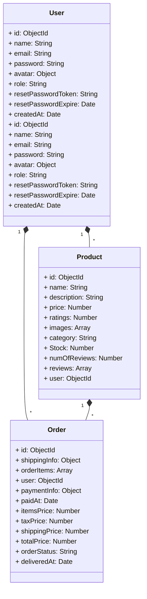

# Database Design

## Base Entity
- `id`: MongoDB provides
- `createdAt`: Date
- `updatedAt`: Date

## User Entity
The User schema defines the structure of the user document in the MongoDB database. It consists of the following fields:

- `name` (String): The user's name.
  - Data type: String
  - Required: Yes
  - Constraints:
    - Maximum length: 30 characters
    - Minimum length: 4 characters

- `email` (String): The user's email address.
  - Data type: String
  - Required: Yes
  - Constraints:
    - Must be a valid email address
    - Must be unique

- `password` (String): The user's password.
  - Data type: String
  - Required: Yes
  - Constraints:
    - Minimum length: 8 characters
  - Note: The password field is not included in query results (`select: false`).

- `avatar` (Object): The user's avatar information.
  - `public_id` (String): The public ID of the avatar image.
    - Data type: String
    - Required: Yes
  - `url` (String): The URL of the avatar image.
    - Data type: String
    - Required: Yes

- `role` (String): The user's role.
  - Data type: String
  - Default: "user"

- `resetPasswordToken` (String): Token used for resetting the user's password.

- `resetPasswordExpire` (Date): Expiration date of the reset password token.

## Product Entity
The Product schema defines the structure of the product document in the MongoDB database. It consists of the following fields:

- `name` (String): The name of the product.
  - Data type: String
  - Required: Yes
  - Constraints: 
    - Must not be empty
    - Leading and trailing whitespaces will be trimmed.

- `description` (String): The description of the product.
  - Data type: String
  - Required: Yes

- `price` (Number): The price of the product.
  - Data type: Number
  - Required: Yes
  - Constraints:
    - Maximum value: 99999999
    - Represents the price in the default currency (without decimals).

- `ratings` (Number): The average rating of the product.
  - Data type: Number
  - Default: 0

- `images` (Array): An array of images associated with the product.
  - Array items:
    - `public_id` (String): The public ID of the image.
      - Data type: String
      - Required: Yes
    - `url` (String): The URL of the image.
      - Data type: String
      - Required: Yes

- `category` (String): The category of the product.
  - Data type: String
  - Required: Yes

- `Stock` (Number): The available stock quantity of the product.
  - Data type: Number
  - Required: Yes
  - Constraints:
    - Maximum value: 9999
  - Default: 1

- `numOfReviews` (Number): The number of reviews for the product.
  - Data type: Number
  - Default: 0

- `reviews` (Array): An array of reviews for the product.
  - Array items:
    - `user` (ObjectId): The unique identifier of the user who posted the review.
      - Data type: ObjectId
      - Reference: "User" collection
      - Required: Yes
    - `name` (String): The name of the user who posted the review.
      - Data type: String
      - Required: Yes
    - `rating` (Number): The rating given in the review.
      - Data type: Number
      - Required: Yes
    - `comment` (String): The comment provided in the review.
      - Data type: String
      - Required: Yes

- `user` (ObjectId): The unique identifier of the user who created the product.
  - Data type: ObjectId
  - Reference: "User" collection
  - Required: Yes

## Order Entity
The Order schema defines the structure of the order document in the MongoDB database. It consists of the following fields:

- `shippingInfo` (Object): Shipping information for the order.
  - `address` (String): The shipping address.
    - Data type: String
    - Required: Yes
  - `city` (String): The city for the shipping address.
    - Data type: String
    - Required: Yes
  - `state` (String): The state for the shipping address.
    - Data type: String
    - Required: Yes
  - `country` (String): The country for the shipping address.
    - Data type: String
    - Required: Yes
  - `pinCode` (Number): The postal code for the shipping address.
    - Data type: Number
    - Required: Yes
  - `phoneNo` (Number): The phone number for the shipping address.
    - Data type: Number
    - Required: Yes

- `orderItems` (Array): An array of items included in the order.
  - Array items:
    - `name` (String): The name of the item.
      - Data type: String
      - Required: Yes
    - `price` (Number): The price of the item.
      - Data type: Number
      - Required: Yes
    - `quantity` (Number): The quantity of the item.
      - Data type: Number
      - Required: Yes
    - `image` (String): The image URL of the item.
      - Data type: String
      - Required: Yes
    - `product` (ObjectId): The unique identifier of the product associated with the item.
      - Data type: ObjectId
      - Reference: "Product" collection
      - Required: Yes

- `user` (ObjectId): The unique identifier of the user who placed the order.
  - Data type: ObjectId
  - Reference: "User" collection
  - Required: Yes

- `paymentInfo` (Object): Payment information for the order.
  - `id` (String): The payment ID.
    - Data type: String
    - Required: Yes
  - `status` (String): The payment status.
    - Data type: String
    - Required: Yes

- `paidAt` (Date): The date and time when the payment was made.
  - Data type: Date
  - Required: Yes

- `itemsPrice` (Number): The total price of all items in the order.
  - Data type: Number
  - Required: Yes
  - Default: 0

- `taxPrice` (Number): The total tax amount for the order.
  - Data type: Number
  - Required: Yes
  - Default: 0

- `shippingPrice` (Number): The shipping cost for the order.
  - Data type: Number
  - Required: Yes
  - Default: 0

- `totalPrice` (Number): The total price of the order (including items, tax, and shipping).
  - Data type: Number
  - Required: Yes
  - Default: 0

- `orderStatus` (String): The status of the order.
  - Data type: String
  - Required: Yes
  - Default: "Processing"

- `deliveredAt` (Date): The date and time when the order was delivered.

```mermaid
erDiagram
    User ||..o{ Order : places
    User ||..|{ Review : posts
    User ||..o{ Product : creates
    Product ||--o{ OrderItem : includes
    Product ||--|{ Review : has
    Order ||--|{ OrderItem : contains
    Review }|..|{ Product : belongs to
    Order }|--|{ User : belongs to
    Order }|--|{ Product : contains
    Order }|--|{ User : belongs to
    Order }|--|{ User : belongs to
```
